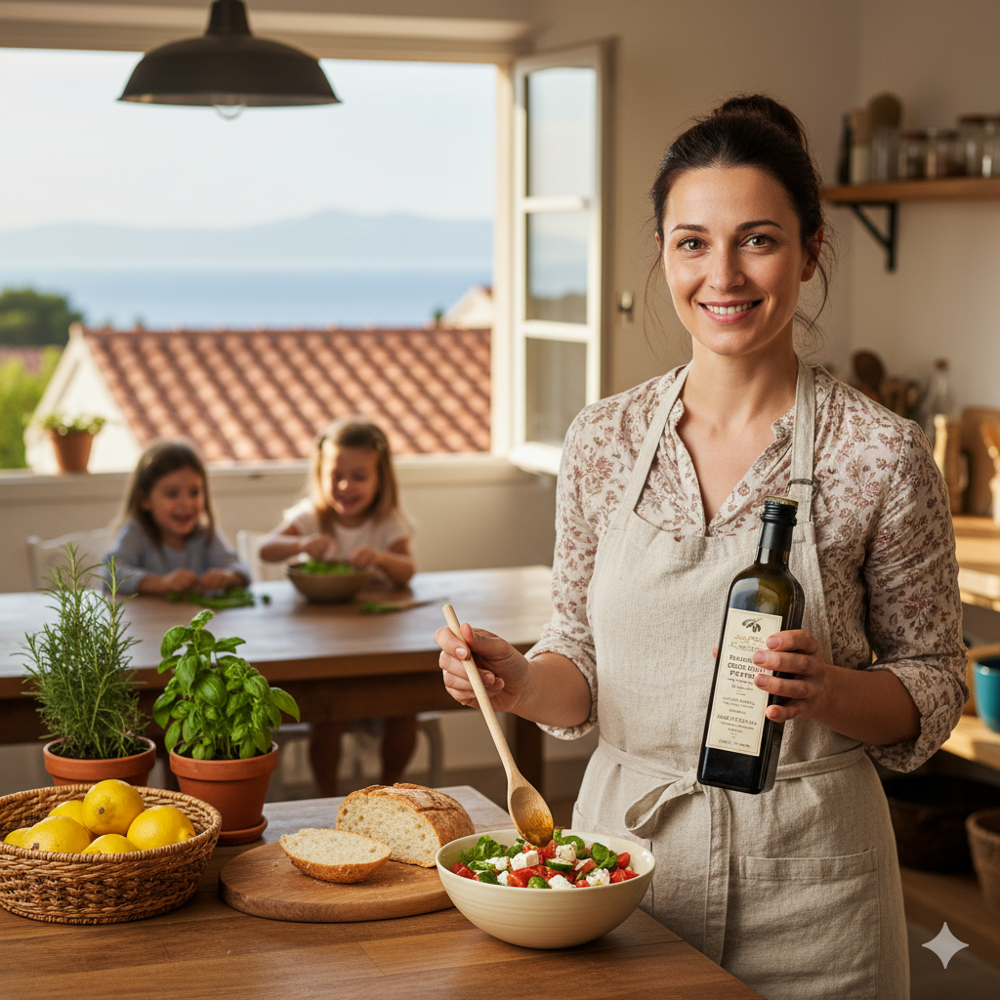
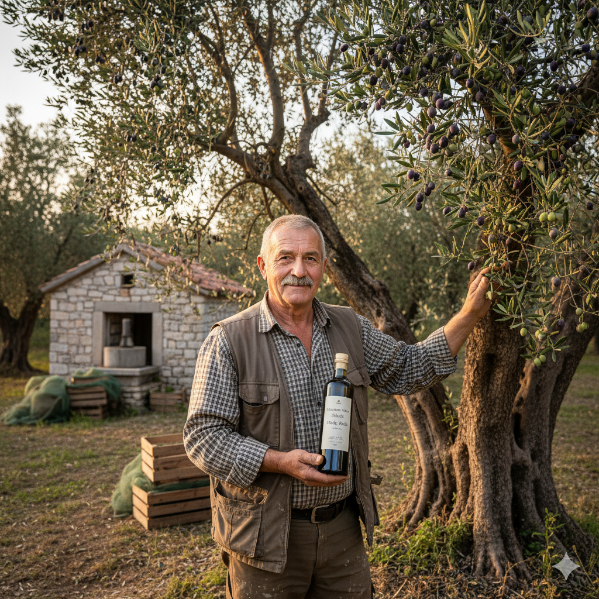
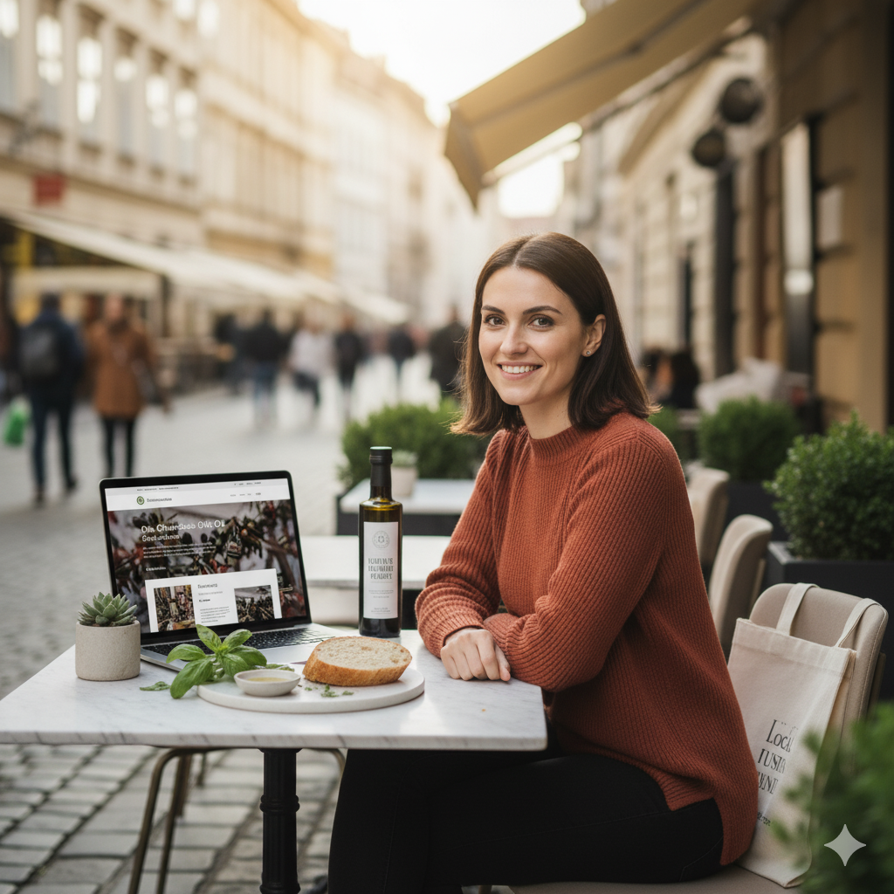
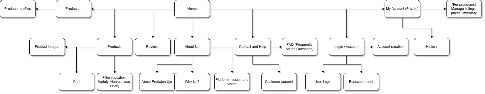

# User personas and information architecture

## Contents
- [User Personas](#user-personas)
  - [User Persona 1: The Home Cook](#user-persona-1-the-home-cook)
  - [User Persona 2: The Hobbyist Producer](#user-persona-2-the-hobbyist-producer)
  - [User Persona 3: The Eco-Conscious Young Professional](#user-persona-3-the-eco-conscious-young-professional)
- [Information Architecture](#information-architecture)
- [Sitemap](#sitemap)
- [LLM prompts](#llm-prompts)

---

## User Personas

### User Persona 1: The Home Cook

<table>
    <tr>
        <td></td>
        <td>
            • Name: Maria Petrović 
            • Age: 35 
            • Gender: Female 
            • Location: Split, Croatia 
            • Occupation: Stay-at-home mom 
            • Education: High school diploma 
            • Tech familiarity: Moderate
        </td>
    </tr>
</table>

**Personality traits**

* Caring, health-conscious, and family-oriented. Maria values tradition, authenticity, and simplicity in her daily life. She enjoys cooking and believes in using locally sourced, high-quality ingredients for her family’s meals. She’s moderately confident with technology and appreciates websites that are straightforward, honest, and visually appealing. Maria tends to make decisions based on trust, reviews, and the story behind the products she buys.

**Goals and motivations**

* To find trustworthy, high-quality olive oils from local producers for her family’s meals.
* To support sustainable, small-scale farms and promote traditional production methods.
* To easily compare prices, certifications, and delivery options when buying online.
* To feel connected to the producers and understand where her food comes from.

**Pain points**

* Difficulty verifying whether products sold online are truly local or organic.
* Complicated checkout processes or unclear delivery information.
* Overly cluttered websites that make comparison and decision-making difficult.

---

### User Persona 2: The Hobbyist Producer

<table>
    <tr>
        <td></td>
        <td>
            • Name: Marko Radić 
            • Age: 60 
            • Gender: Male 
            • Location: Zadar, Croatia 
            • Occupation: Auto mechanic 
            • Education: Technical vocational school 
            • Tech familiarity: Low to moderate
        </td>
    </tr>
</table>

**Personality traits**

* Proud, hardworking, and community-minded, Marko takes great pride in continuing his family’s olive oil tradition. He values craftsmanship and honesty over commercial appeal. Though not highly tech-savvy, he is eager to share his product with a wider audience if the process is simple and trustworthy. He appreciates straightforward platforms that let him tell his story and manage his sales without frustration.

**Goals and motivations**

* To sell small batches of his family’s olive oil directly to appreciative customers.
* To reach buyers who care about authenticity and heritage.
* To build recognition for the quality of his oil and the effort behind it.
* To have a user-friendly online tool for managing listings, prices, and sales.

**Pain points**

* Finds most online selling platforms too complex or designed for large-scale producers.
* Struggles with writing product descriptions and uploading content.
* Lacks marketing knowledge and dislikes complicated registration processes.

---

### User Persona 3: The Eco-Conscious Young Professional

<table>
    <tr>
        <td></td>
        <td>
            • Name: Ana Kovač 
            • Age: 28 
            • Gender: Female 
            • Location: Zagreb, Croatia 
            • Occupation: Marketing specialist 
            • Education: Master’s in Communications 
            • Tech familiarity: High
        </td>
    </tr>
</table>

**Personality traits**

* Urban, environmentally aware, and socially engaged. Ana values sustainability, design, and transparency in the brands she supports. She enjoys discovering unique, local products and sharing them with friends or followers online. She’s digitally savvy, detail-oriented, and appreciates seamless digital experiences with strong visual storytelling.

**Goals and motivations**

* To discover premium, sustainably produced olive oils with transparent sourcing.
* To purchase gifts for friends that reflect her values and lifestyle.
* To easily follow and support her favorite local producers.
* To engage with a community of eco-conscious consumers and share experiences online.

**Pain points**

* Feels overwhelmed by too many similar-looking products without clear sustainability details.
* Frustrated by slow delivery or lack of transparency about shipping and origin.
* Dislikes poorly designed websites or long, tedious checkout processes.

---

## Information Architecture

The information architecture of Prodajen Uje was designed to make it simple for users to navigate the platform, find authentic local olive oils, and purchase products directly from small producers. The structure reflects the needs of the two main user groups: small olive oil producers and customers who value high-quality, locally produced oils.

- **Home Page**
    - Overview of Prodajen Uje and its purpose
    - Featured producers and highlighted olive oils
    - Quick navigation to browse products by type, location, or harvest year
    - User testimonials and reviews of producers or oils
- **Producers**
    - Profiles of small olive oil producers
    - Producer story, history, and production philosophy
- **Products**
    - Olive oil listings with filtering options (location, variety, harvest year)
    - Short description of each product
    - Price list and available quantities
    - Product images
    - Add to cart/purchase options
- **Reviews**
    - Customer reviews and ratings of producers and products
- **About Us**
    - Story behind Prodajen Uje
    - Platform mission and vision
    - Why us?
- **Contact and Help**
    - Frequently Asked Questions (FAQ)
    - Customer support contacts
- **Login / Account**
    - User login for customers and producers
    - Account creation and password reset options
- **My Account** (Private)
    - Personalized overview of purchased products and orders
    - Producers can manage their listings, prices, and inventory

---
## Sitemap

---

## LLM prompts
- Here are the LLM prompts we used for this assignment: 
  - Generate a set of three realistic user personas for Prodajen Uje, a digital marketplace that connects small olive oil producers with customers who value authentic, locally made olive oil. The personas should reflect different types of users and capture their motivations, goals, and frustrations when engaging with the platform. Focus on creating believable characters that help illustrate how and why people would use Prodajen Uje from both the producer and customer perspectives.
  - Using the card sorting method, create a clear and logical Information Architecture and Sitemap for Prodajen Uje, a platform that connects small olive oil producers with customers who appreciate authentic, locally made products. Base the structure on how users would naturally group and navigate information when exploring or managing olive oil listings. The output should describe the main sections and subpages along with their relationships.
